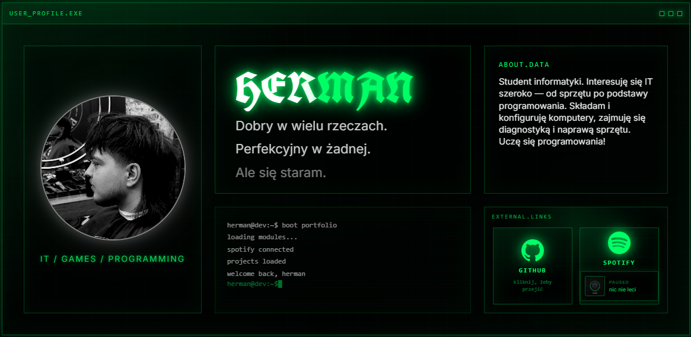

# 💻 HERMANOS BREACH PROTOCOL

> ACCESS GRANTED

Portfolio stworzone przeze mnie jako miejsce do prezentacji projektów, nauki programowania i rozwoju w IT.

🌐 Live: https://hermanportfolio.pl

## 📖 O projekcie

To nie jest klasyczne portfolio.

Zamiast kolejnej strony z białym tłem i listą umiejętności postawiłem na klimat terminala oraz fikcyjnego systemu "HERMANOS", który przedstawia moje projekty, umiejętności i drogę rozwoju jako studenta informatyki.

Portfolio pokazuje zarówno ukończone projekty, jak i technologie, których aktualnie się uczę.

## 🚀 Funkcje

- Interfejs inspirowany terminalem
- Responsywny design
- Sekcja projektów
- Kontakt przez formularz
- Animacje i efekty wizualne
- Prezentacja aktualnie rozwijanych umiejętności

## 🛠 Technologie

- HTML5
- CSS3
- JavaScript
- Node.js
- Express.js

## 📂 Aktualne umiejętności

```txt
C            █████░░░░░  podstawy
JavaScript   ██████░░░░  aktywna nauka
Node.js      █████░░░░░  backend
HTML         ███████░░░  semantyka
CSS          ██████░░░░  layout i responsive
```

## 🎯 Cel projektu

Głównym celem portfolio jest dokumentowanie mojego rozwoju w IT.

Regularnie dodaję nowe projekty, poprawiam istniejące rozwiązania i uczę się kolejnych technologii, dlatego strona będzie stale rozwijana.

## 📸 Podgląd



## 📬 Kontakt

Jeżeli masz pytania lub chcesz się skontaktować:

📧 przez formularz na stronie

🌐 https://hermanportfolio.pl

---

```txt
USER: HERMAN
STATUS: ONLINE
MODE: DEVELOPER
MISSION: KEEP LEARNING
```
